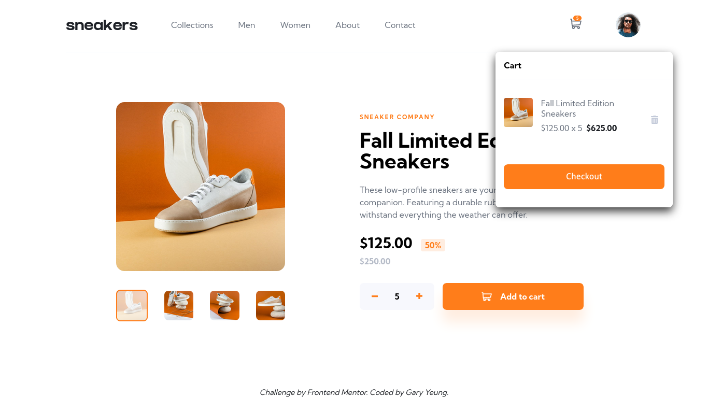
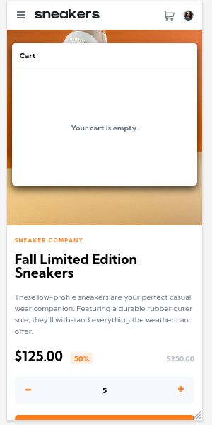
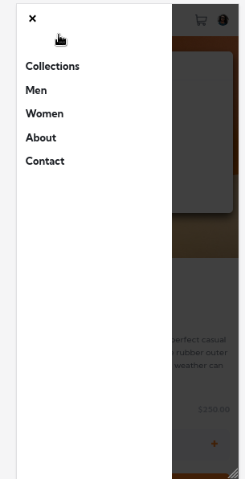

# Frontend Mentor - E-commerce product page solution

This is a solution to the [E-commerce product page challenge on Frontend Mentor](https://www.frontendmentor.io/challenges/ecommerce-product-page-UPsZ9MJp6). Frontend Mentor challenges help you improve your coding skills by building realistic projects.

## Table of contents

- [Overview](#overview)
  - [The challenge](#the-challenge)
  - [Screenshot](#screenshot)
  - [Links](#links)
- [My process](#my-process)
  - [Built with](#built-with)
  - [What I learned](#what-i-learned)
  - [Continued development](#continued-development)
  - [Useful resources](#useful-resources)
- [Author](#author)
- [Acknowledgments](#acknowledgments)

## Overview

### The challenge

Users should be able to:

- View the optimal layout for the site depending on their device's screen size
- See hover states for all interactive elements on the page
- Open a lightbox gallery by clicking on the large product image
- Switch the large product image by clicking on the small thumbnail images
- Add items to the cart
- View the cart and remove items from it

### Screenshot

### Links
- Solution URL: [Solution](https://github.com/garyeung/Frontend-Mentor-Challenges/tree/master/ecommerce-product-page-main)
- Live Site URL: [Live](https://garyeung.github.io/Frontend-Mentor-Challenges/ecommerce-product-page-main)

## My process

### Built with

- Semantic HTML5 markup
- CSS custom properties
- Flexbox
- CSS Grid
- Mobile-first workflow
- [React](https://reactjs.org/) - JS library
- [Less](https://lesscss.org/) - For styles
- [Vite](https://vitejs.dev/)  - For development and building 

### What I learned
I know more about what React is. The core concepts of React are props and states. States are created inside the component.  
The communication between components is done by passing props.   
And I have learned how to use useReduer and useContext.   
And realised that tailwindCSS is more suitable than modular CSS in today when frontend development is becoming more and more modular. atomic style CSS is better decoupled from html.   You don't need to write another html structure in css files.

### Continued development
Create a full version of the e-commerce application.  
Use Rotuer to render each page.  
Make the components more modular.  

### Useful resources

## Author

## Acknowledgments
